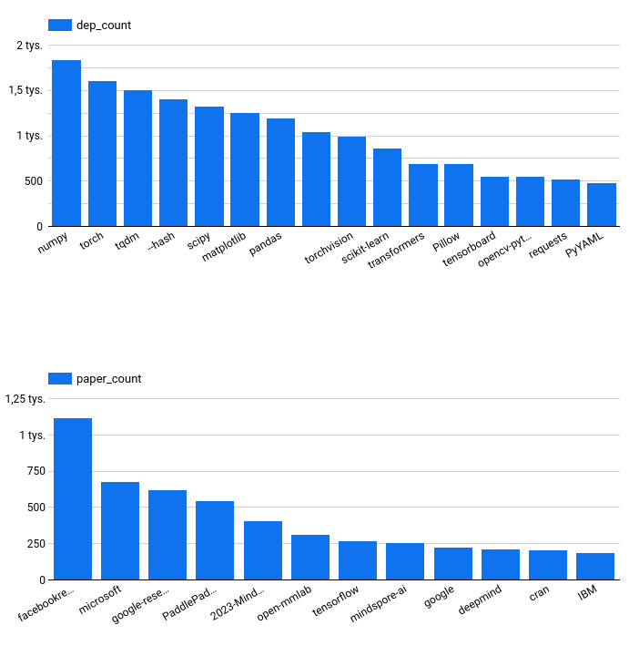
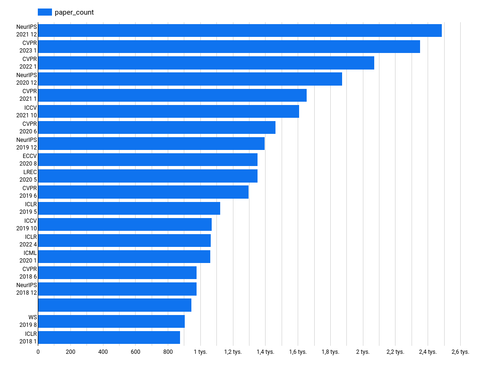

# de-zoomcamp-project
The final project for the Data Engineering Zoomcamp - Data Pipeline for Research Papers and Repos

# Papers And Code
The goal of this project was to develop a data pipeline, which ingests paperswithcode date, complements it with some repo parsing using github REST API
and combining it with github archive Big Query project to build a simple data warehouse of papers and their corresponding repos. 

Main steps:
1. Data ingestion using a pyspark job submitted to google dataproc. The job downloads the data to a gcs bucket, performs some simple transformations in pyspark and loads the data to big query.
2. A downstream task uses github REST API to download and parse data about dependencies from research paper github repos written in python.
3. Another job loads the data from github archive big query project to this data warehouse, using gq data transfer service to move the data from US to EU region
4. These steps are orchestrated in Prefect and deployed to run on a daily basis.
5. Then a dbt project picks up the data warehouse tables and builds a reporting dataset with models capturing interesting stats.
6. Data loooker reports are created using the reporting dataset. Here are some visualizations created using the data warehouse:

